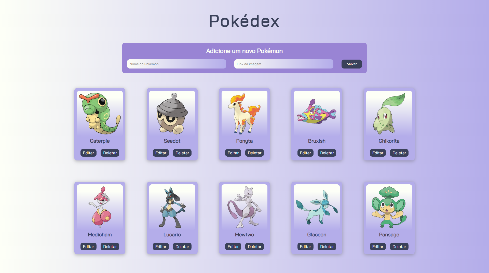

<h1 align="center">CRUD DJANGO</h1>

<p align = "center">
  
</p>

## 💻 Projeto

Esse é um projeto simples de um CRUD de uma Pokédex. <br>
OBS: Tem muitas implementações que poderia ser feitas, porém para um CRUD inicial ele serve seu proposito.

## ✔️ Tecnologias utilizadas

- ``DJANGO``
- ``SQLITE``
- ``HTML``
- ``CSS``

## :hammer: Funcionalidades do projeto

- `Create`: Adicionar novos Pokémons no seu banco de dados informando o nome e o link da imagem
- `Update`: Atualizar informações de um Pokémon específico
- `Delete`: Remover o Pokémon do seu banco de dados
- `Titulo`: Ao clicar no titulo você será redirecionado para a página de Pokémons, para obter o links das imagens


## 🔌 Como rodar o projeto | Local
### Pré-requisitos

Antes de começar, você vai precisar ter instalado em sua máquina as seguintes ferramentas:
[Git](https://git-scm.com),[Python](https://www.python.org/downloads/).<br>
Além disto é bom ter um editor para trabalhar com o código como o [VSCode](https://code.visualstudio.com/)

### 🎲 Rodando o Back End (servidor)


### Clone este repositório
```bash
git clone https://github.com/alisson-vml/crud_django_pokedex.git
```
### Cria um ambiente virtual para as dependências
```bash
python -m venv env
```
### Ative seu ambiente virtual
```bash
.\env\Scripts\activate
```
### Instale as dependências
```bash
pip install -r requirements.txt
```
### Execute a aplicação
```bash
python manage.py runserver
```
### O servidor inciará na porta:8000 - acesse <http://localhost:8000/core>


